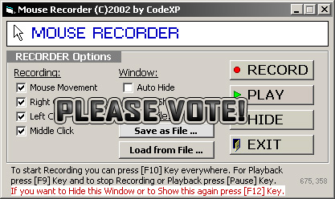



## a MouseRecorder \- Record Mouse Movement and Clicks and Save it to File

### Description

Record Mouse Movement and Clicks (Mouse Actions) and Save it to File.

You can load the Files and Playback it!

please vote! thx!
 
### More Info
 

             |
---                |---
**Submitted On**   |2003-12-22 03:38:32
**By**             |[CodeXP](https://github.com/Planet-Source-Code/PSCIndex/blob/master/ByAuthor/codexp.md)
**Level**          |Advanced
**User Rating**    |4.7 (90 globes from 19 users)
**Compatibility**  |VB 4\.0 \(32\-bit\), VB 5\.0, VB 6\.0
**Category**       |[Files/ File Controls/ Input/ Output](https://github.com/Planet-Source-Code/PSCIndex/blob/master/ByCategory/files-file-controls-input-output__1-3.md)
**World**          |[Visual Basic](https://github.com/Planet-Source-Code/PSCIndex/blob/master/ByWorld/visual-basic.md)
**Archive File**   |[a\_MouseRec1693551122004\.zip](https://github.com/Planet-Source-Code/codexp-a-mouserecorder-record-mouse-movement-and-clicks-and-save-it-to-file__1-50958/archive/master.zip)

